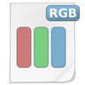
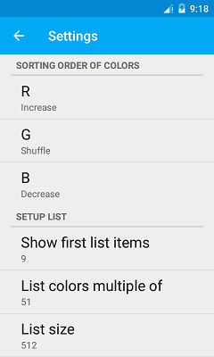

# RGBColors

  

This Android app implements Junior Android developer courses entrance test.

###Additionally:

* The support for changing the sort order (ASCENDING, DESCENDING, SHUFFLE)
    for each color component (RGB) (not to change the code if necessary change the sort order).
* Implemented change the number to display the first list items.
* Realized change in the multiplicity of colors forming the list.
* Implemented a new generation of the list.
* Implemented loading and saving color in a JSON file.
* If you want to generate (to download from the network, database, etc.)
   a large number of colors (content) to create an asynchronous operation / load data
   use AsyncTaskLoader.

### Main

### Settings

Developed By
-------
Igor Gavrilyuk (Graviton57)
License
-------

    Copyright 2017 Graviton57

    Licensed under the Apache License, Version 2.0 (the "License");
    you may not use this file except in compliance with the License.
    You may obtain a copy of the License at

       http://www.apache.org/licenses/LICENSE-2.0

    Unless required by applicable law or agreed to in writing, software
    distributed under the License is distributed on an "AS IS" BASIS,
    WITHOUT WARRANTIES OR CONDITIONS OF ANY KIND, either express or implied.
    See the License for the specific language governing permissions and
    limitations under the License.
